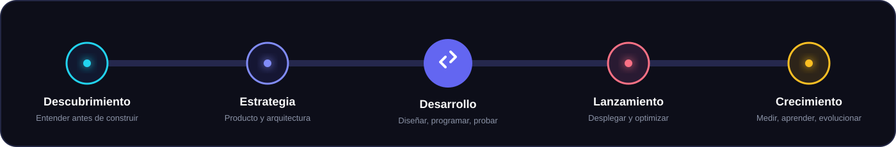
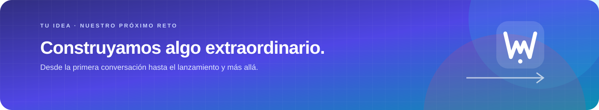

<div align="center">
  <picture>
    <source media="(max-width: 640px)" srcset="./assets/worddev-hero-mobile-v2.png" />
    
  </picture>
</div>

<div align="center">
  <br />
  <a href="https://wordev.lat/"><strong>Website</strong></a>
  &nbsp;·&nbsp;
  <a href="#featured-work"><strong>Explore our work</strong></a>
  &nbsp;·&nbsp;
  <a href="https://wa.me/573215011683"><strong>Let's talk</strong></a>
  &nbsp;·&nbsp;
  <a href="./README.md"><strong>Español</strong></a>
</div>

<br />

## Hello, we are WordDev

We are a digital development studio that turns ideas into **functional, scalable technology products built to grow**. We partner with every project from the first conversation and product strategy through launch, measurement, and continuous evolution.

We do more than write code. We understand the business, design the experience, and build the technology required to turn a good idea into a profitable digital solution.

```javascript
const partnership = await worddev.build({
  idea: "yours",
  strategy: "shared",
  technology: "tailor-made",
  goal: "grow together",
});
```

## What we build

<table>
  <tr>
    <td width="50%" valign="top">
      <h3>01 · Product strategy</h3>
      <p>We turn an idea into a clear proposition: users, scope, priorities, business model, and an actionable roadmap.</p>
      <p><code>Discovery</code> <code>Research</code> <code>Roadmap</code> <code>MVP</code></p>
    </td>
    <td width="50%" valign="top">
      <h3>02 · Custom development</h3>
      <p>We build websites, applications, platforms, management systems, and digital experiences without relying on generic solutions.</p>
      <p><code>Web Apps</code> <code>E-commerce</code> <code>APIs</code> <code>SaaS</code></p>
    </td>
  </tr>
  <tr>
    <td width="50%" valign="top">
      <h3>03 · Launch and delivery</h3>
      <p>We prepare infrastructure, domains, security, performance, and automation to take every product to production with confidence.</p>
      <p><code>DevOps</code> <code>Docker</code> <code>SSL</code> <code>CI/CD</code></p>
    </td>
    <td width="50%" valign="top">
      <h3>04 · Support and growth</h3>
      <p>We stay after launch: observing, maintaining, fixing, and discovering new opportunities for evolution.</p>
      <p><code>Analytics</code> <code>SEO</code> <code>Backups</code> <code>Support</code></p>
    </td>
  </tr>
</table>

## Featured work

A selection of digital experiences exploring different industries, needs, and interaction models.

<table>
  <tr>
    <td width="50%" valign="top" align="center">
      <a href="https://rogue-fit.wordev.lat/"></a>
      <h3>Rogue Fit</h3>
      <p>A fitness and personalized training experience.</p>
      <p><a href="https://rogue-fit.wordev.lat/"><strong>Explore project ↗</strong></a></p>
    </td>
    <td width="50%" valign="top" align="center">
      <a href="https://gym.wordev.lat/"></a>
      <h3>Gym Center</h3>
      <p>A digital management system for gyms.</p>
      <p><a href="https://gym.wordev.lat/"><strong>Explore project ↗</strong></a></p>
    </td>
  </tr>
  <tr>
    <td width="50%" valign="top" align="center">
      <a href="https://hotel.wordev.lat/"></a>
      <h3>Hotel Boutique</h3>
      <p>Booking and digital hospitality experience.</p>
      <p><a href="https://hotel.wordev.lat/"><strong>Explore project ↗</strong></a></p>
    </td>
    <td width="50%" valign="top" align="center">
      <a href="https://gourmet.wordev.lat/"></a>
      <h3>Gourmet Kitchen</h3>
      <p>A visual culinary presence with a digital menu.</p>
      <p><a href="https://gourmet.wordev.lat/"><strong>Explore project ↗</strong></a></p>
    </td>
  </tr>
  <tr>
    <td colspan="2" valign="top" align="center">
      <a href="https://art-galery.wordev.lat/"></a>
      <h3>Art Gallery</h3>
      <p>A virtual gallery for discovering and experiencing art differently.</p>
      <p><a href="https://art-galery.wordev.lat/"><strong>Explore project ↗</strong></a></p>
    </td>
  </tr>
</table>

## How we take an idea to production

<div align="center">
  <picture>
    <source media="(max-width: 640px)" srcset="./assets/process-mobile.svg" />
    
  </picture>
</div>

## Technology with purpose

We choose tools based on the problem, expected scale, and reality of each project. Our ecosystem includes:

| Experience | Applications | Data | Delivery |
|:--|:--|:--|:--|
| React · Next.js | Node.js · Python | PostgreSQL | Docker · Nginx |
| TypeScript · Vite | PHP · Laravel | MySQL | Linux · CI/CD |
| UI/UX · Responsive | APIs · Integrations | Modeling · Analytics | Hosting · Observability |

## How we think

- **Business first.** A technically brilliant solution matters only when it solves a real need.
- **Direct communication.** Decisions, progress, and risks should be easy to understand.
- **Code built to evolve.** We create clean, documented, and maintainable foundations.
- **Transparency from day one.** Clear scope, priorities, and costs throughout the process.
- **Launch is not the finish line.** We measure, learn, and keep building.

<br />

<div align="center">
  <a href="https://wordev.lat/#contacto"></a>
</div>

<div align="center">
  <br />
  <strong>Do you have an idea or a digital challenge?</strong>
  <br /><br />
  <a href="https://wordev.lat/">wordev.lat</a>
  &nbsp;·&nbsp;
  <a href="mailto:hola@worddev.com">hola@worddev.com</a>
  &nbsp;·&nbsp;
  <a href="https://wa.me/573215011683">WhatsApp</a>
  &nbsp;·&nbsp;
  <a href="https://www.linkedin.com/in/wordev-8699253a4/">LinkedIn</a>
  <br /><br />
  <sub>Built with judgment, curiosity, and code from Colombia.</sub>
</div>
