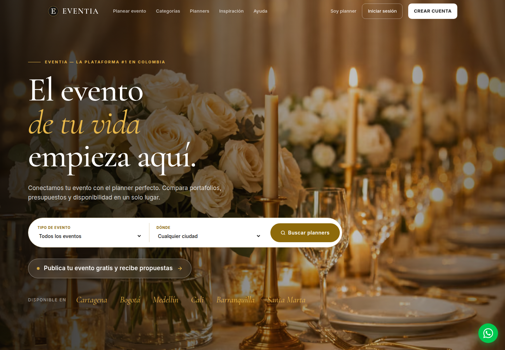

  <h3>Idioma de la presentación</h3>
  
  

 

  <picture>
    <source media="(max-width: 640px)" srcset="./assets/worddev-hero-mobile-v2.png" />
    
  </picture>

   
  <a href="https://wordev.lat/"><strong>Sitio web</strong></a>
  &nbsp;·&nbsp;
  <a href="#proyectos-destacados"><strong>Explorar proyectos</strong></a>
  &nbsp;·&nbsp;
  <a href="https://wa.me/573215011683"><strong>Hablemos</strong></a>

 

## Hola, somos WordDev

Somos un equipo colombiano que convierte ideas en **sitios web, tiendas en línea, aplicaciones y sistemas fáciles de usar**.

Te acompañamos desde la primera conversación hasta el lanzamiento y el crecimiento de tu proyecto. Tú conoces tu negocio; nosotros te ayudamos a llevarlo al mundo digital.

## Lo que hacemos

<table width="100%">
  <tr>
    <td width="50%" valign="top">
       
      

      <h3>01 · Aterrizamos tu idea</h3>
      
Entendemos qué quieres lograr, para quién lo quieres crear y cuál es la mejor forma de comenzar.

       
    </td>
    <td width="50%" valign="top">
       
      

      <h3>02 · Creamos tu producto</h3>
      
Diseñamos y desarrollamos sitios web, tiendas en línea, aplicaciones y sistemas pensados para tus necesidades.

       
    </td>
  </tr>
  <tr>
    <td width="50%" valign="top">
       
      

      <h3>03 · Lo ponemos en marcha</h3>
      
Publicamos tu producto, revisamos que todo funcione bien y lo dejamos listo para recibir a tus usuarios.

       
    </td>
    <td width="50%" valign="top">
       
      

      <h3>04 · Seguimos contigo</h3>
      
Después del lanzamiento resolvemos problemas, hacemos mejoras y ayudamos a que el proyecto siga creciendo.

       
    </td>
  </tr>
</table>

## Proyectos destacados

Productos reales creados para operaciones reales.

<table>
  <tr>
    <td width="50%" valign="top" align="center">
      
      <h3>Reklu ATS</h3>
      
Plataforma multiempresa de reclutamiento para vacantes, candidatos, flujos, reportes y cumplimiento.

      
<a href="https://reklu.co/"><strong>Ver proyecto</strong>&nbsp;</a>

    </td>
    <td width="50%" valign="top" align="center">
      
      <h3>ReciboPagos</h3>
      
Experiencia responsiva de producto y comercio para conocer soluciones de pago presenciales y en línea.

      
<a href="https://recibopagos.staging.terap-ia.lat/"><strong>Ver proyecto</strong>&nbsp;</a>

    </td>
  </tr>
  <tr>
    <td width="50%" valign="top" align="center">
      
      <h3>Eventia</h3>
      
Marketplace de eventos para descubrir profesionales, comparar propuestas, contratar y comunicarse en un mismo lugar.

      
<a href="https://eventia.events/"><strong>Ver proyecto</strong>&nbsp;</a>

    </td>
    <td width="50%" valign="top" align="center">
      
      <h3>AFA Transfers</h3>
      
Plataforma multilingüe para traslados de aeropuerto, viajes privados, excursiones, reservas y operación de transporte en México.

      
<a href="https://www.afatransfers.com/"><strong>Ver proyecto</strong>&nbsp;</a>

    </td>
  </tr>
</table>

## De la idea al lanzamiento

  
  &nbsp;&nbsp;&nbsp;
  
  &nbsp;&nbsp;&nbsp;
  
  &nbsp;&nbsp;&nbsp;
  
  &nbsp;&nbsp;&nbsp;
  

1. **Escuchamos.** Entendemos tu idea, tus clientes y el resultado que buscas.
2. **Trazamos el camino.** Definimos qué construiremos y qué haremos primero.
3. **Lo hacemos realidad.** Diseñamos, desarrollamos y revisamos cada parte contigo.
4. **Lo lanzamos.** Publicamos el producto y comprobamos que todo funcione correctamente.
5. **Lo ayudamos a crecer.** Seguimos presentes para mantenerlo y mejorarlo.

## Trabajar con WordDev significa

- **Entender antes de construir.** Primero escuchamos tu necesidad y tus objetivos.
- **Hablar claro.** Explicamos avances, decisiones y dificultades sin palabras complicadas.
- **Saber siempre dónde estamos.** Acordamos desde el inicio el alcance, las prioridades y los costos.
- **Pensar en el futuro.** Creamos una base que pueda adaptarse a nuevas necesidades.
- **Seguir después del lanzamiento.** Te acompañamos cuando el producto ya está en manos de sus usuarios.

 

  <a href="https://wordev.lat/#contacto">
    <picture>
      <source media="(max-width: 640px)" srcset="./assets/contact-wordlings-mobile.png" />
      
    </picture>
  </a>

   
  <strong>Tu idea puede ser nuestro próximo proyecto.</strong>
   
  Cuéntanos qué quieres crear.
    
  <a href="https://wordev.lat/">wordev.lat</a>
  &nbsp;·&nbsp;
  <a href="mailto:hola@worddev.com">hola@worddev.com</a>
  &nbsp;·&nbsp;
  <a href="https://wa.me/573215011683">WhatsApp</a>
  &nbsp;·&nbsp;
  <a href="https://www.linkedin.com/in/wordev-8699253a4/">LinkedIn</a>
    
  Creamos productos digitales desde Colombia para cualquier lugar. ❤️

