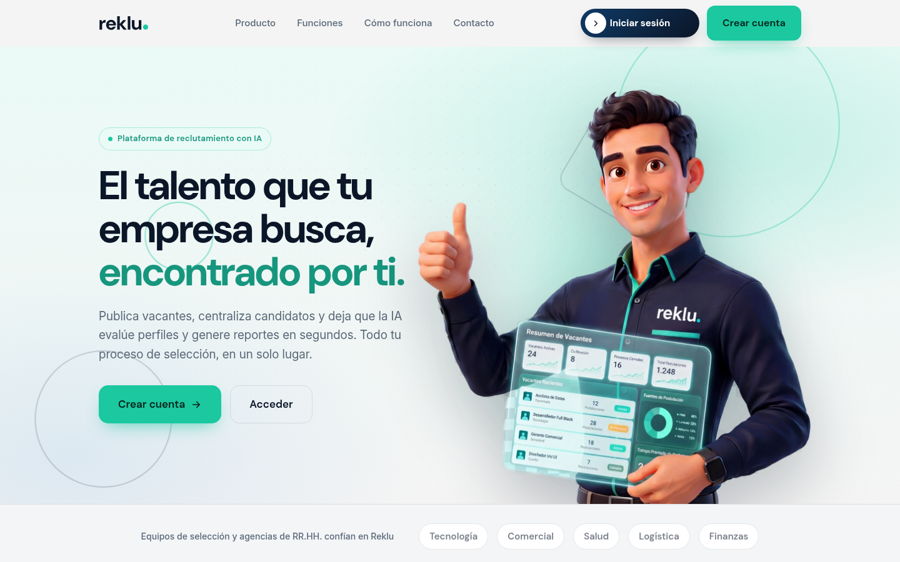
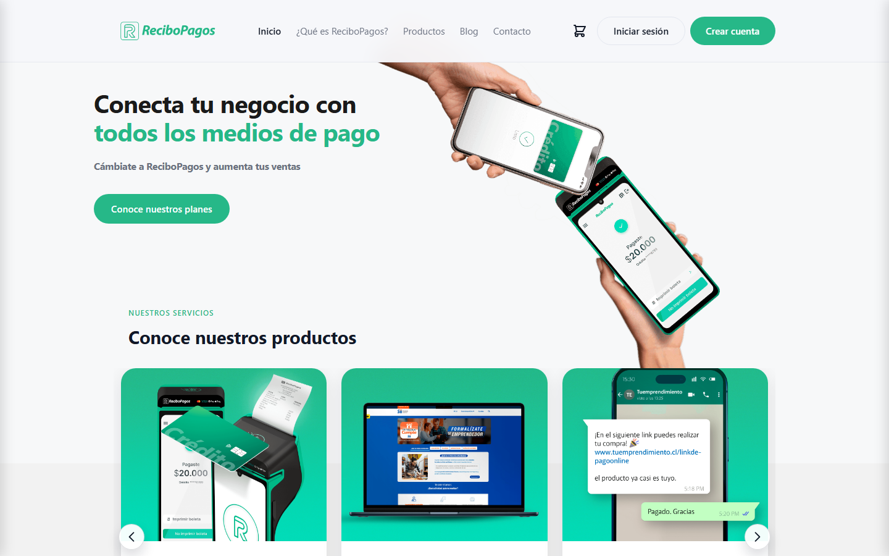
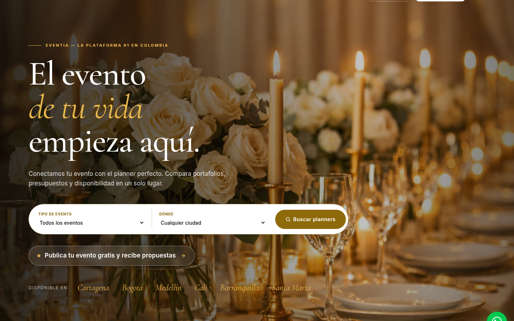
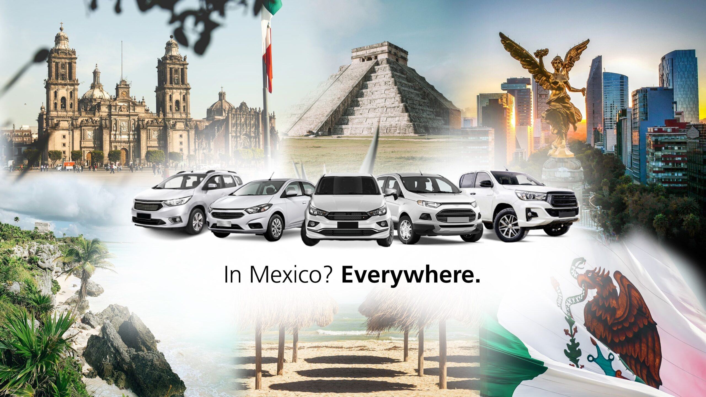

  <h3>Documentation language</h3>
  
  

 

  <picture>
    <source media="(max-width: 640px)" srcset="./assets/worddev-hero-mobile-v2.png" />
    
  </picture>

   
  <a href="https://wordev.lat/"><strong>Website</strong></a>
  &nbsp;·&nbsp;
  <a href="#featured-work"><strong>Explore our work</strong></a>
  &nbsp;·&nbsp;
  <a href="https://wa.me/573215011683"><strong>Let's talk</strong></a>

 

## Hello, we are WordDev

We are a Colombian team that turns ideas into **websites, online stores, applications, and systems that are easy to use**.

We support you from the first conversation through launch and growth. You know your business; we help you bring it into the digital world.

## What we do

<table width="100%">
  <tr>
    <td width="50%" valign="top">
       
      

      <h3>01 · Shape your idea</h3>
      
We understand what you want to achieve, who it is for, and the best way to get started.

       
    </td>
    <td width="50%" valign="top">
       
      

      <h3>02 · Create your product</h3>
      
We design and build websites, online stores, applications, and systems made for your needs.

       
    </td>
  </tr>
  <tr>
    <td width="50%" valign="top">
       
      

      <h3>03 · Bring it online</h3>
      
We publish your product, check that everything works, and prepare it to welcome your users.

       
    </td>
    <td width="50%" valign="top">
       
      

      <h3>04 · Stay by your side</h3>
      
After launch, we solve problems, make improvements, and help the project keep growing.

       
    </td>
  </tr>
</table>

## Featured work

Real products built for real operations.

<table>
  <tr>
    <td width="50%" valign="top" align="center">
      
      <h3>Reklu ATS</h3>
      
A multi-tenant recruiting platform for vacancies, candidates, workflows, reporting, and compliance.

      
<a href="https://reklu.co/"><strong>View project</strong>&nbsp;</a>

    </td>
    <td width="50%" valign="top" align="center">
      
      <h3>ReciboPagos</h3>
      
A responsive product and commerce experience for discovering in-person and online payment solutions.

      
<a href="https://recibopagos.staging.terap-ia.lat/"><strong>View project</strong>&nbsp;</a>

    </td>
  </tr>
  <tr>
    <td width="50%" valign="top" align="center">
      
      <h3>Eventia</h3>
      
An event-planning marketplace for discovering professionals, comparing proposals, hiring, and communicating in one place.

      
<a href="https://eventia.events/"><strong>View project</strong>&nbsp;</a>

    </td>
    <td width="50%" valign="top" align="center">
      
      <h3>AFA Transfers</h3>
      
A multilingual platform for airport transfers, private rides, excursions, bookings, and transportation operations in Mexico.

      
<a href="https://www.afatransfers.com/"><strong>View project</strong>&nbsp;</a>

    </td>
  </tr>
</table>

## From idea to launch

  
  &nbsp;&nbsp;&nbsp;
  
  &nbsp;&nbsp;&nbsp;
  
  &nbsp;&nbsp;&nbsp;
  
  &nbsp;&nbsp;&nbsp;
  

1. **We listen.** We learn about your idea, your customers, and the result you want.
2. **We map the path.** We define what we will build and what comes first.
3. **We bring it to life.** We design, build, and review every part with you.
4. **We launch it.** We publish the product and make sure everything works correctly.
5. **We help it grow.** We stay involved to maintain and improve it.

## Working with WordDev means

- **Understanding before building.** We begin by listening to your needs and goals.
- **Speaking clearly.** We explain progress, decisions, and difficulties without complicated language.
- **Always knowing where we stand.** We agree on scope, priorities, and costs from the beginning.
- **Thinking ahead.** We create a foundation that can adapt to new needs.
- **Staying after launch.** We support you once the product is in your users' hands.

 

  <a href="https://wordev.lat/#contacto">
    <picture>
      <source media="(max-width: 640px)" srcset="./assets/contact-wordlings-mobile.png" />
      
    </picture>
  </a>

   
  <strong>Your idea could be our next project.</strong>
   
  Tell us what you want to create.
    
  <a href="https://wordev.lat/">wordev.lat</a>
  &nbsp;·&nbsp;
  <a href="mailto:hola@worddev.com">hola@worddev.com</a>
    
  We create digital products from Colombia for anywhere in the world. ❤️

