

  <picture>
    <source media="(max-width: 640px)" srcset="./assets/worddev-hero-mobile-v2.png" />
    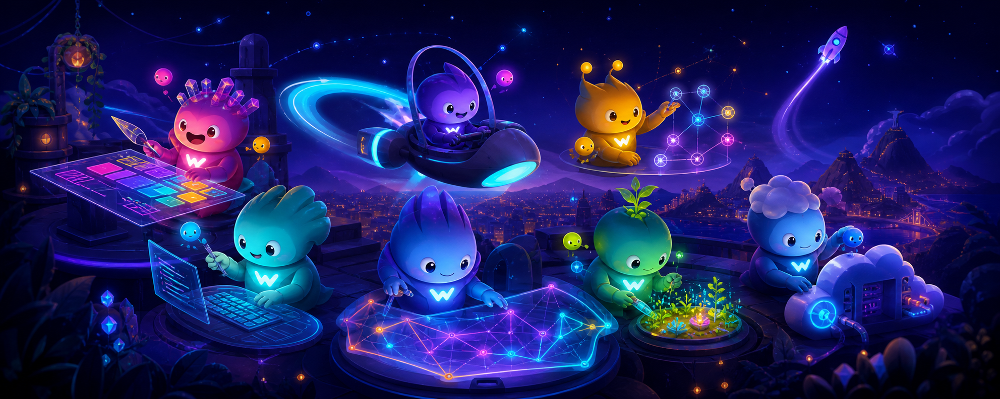
  </picture>

   
  <a href="https://wordev.lat/"><strong>Sitio web</strong></a>
  &nbsp;·&nbsp;
  <a href="#proyectos-destacados"><strong>Explorar proyectos</strong></a>
  &nbsp;·&nbsp;
  <a href="https://wa.me/573215011683"><strong>Hablemos</strong></a>
  &nbsp;·&nbsp;
  <a href="./README.en.md"><strong>English</strong></a>

 

## Hola, somos WordDev

Somos un equipo colombiano que convierte ideas en **sitios web, tiendas en línea, aplicaciones y sistemas fáciles de usar**.

Te acompañamos desde la primera conversación hasta el lanzamiento y el crecimiento de tu proyecto. Tú conoces tu negocio; nosotros te ayudamos a llevarlo al mundo digital.

## Lo que hacemos

<table width="100%">
  <tr>
    <td width="50%" valign="top">
       
      
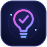

      <h3>01 · Aterrizamos tu idea</h3>
      
Entendemos qué quieres lograr, para quién lo quieres crear y cuál es la mejor forma de comenzar.

       
    </td>
    <td width="50%" valign="top">
       
      
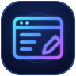

      <h3>02 · Creamos tu producto</h3>
      
Diseñamos y desarrollamos sitios web, tiendas en línea, aplicaciones y sistemas pensados para tus necesidades.

       
    </td>
  </tr>
  <tr>
    <td width="50%" valign="top">
       
      
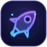

      <h3>03 · Lo ponemos en marcha</h3>
      
Publicamos tu producto, revisamos que todo funcione bien y lo dejamos listo para recibir a tus usuarios.

       
    </td>
    <td width="50%" valign="top">
       
      
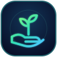

      <h3>04 · Seguimos contigo</h3>
      
Después del lanzamiento resolvemos problemas, hacemos mejoras y ayudamos a que el proyecto siga creciendo.

       
    </td>
  </tr>
</table>

## Proyectos destacados

Una selección de experiencias creadas para explorar diferentes industrias, necesidades y formas de interacción digital.

<table>
  <tr>
    <td width="50%" valign="top" align="center">
      <a href="https://rogue-fit.wordev.lat/">
        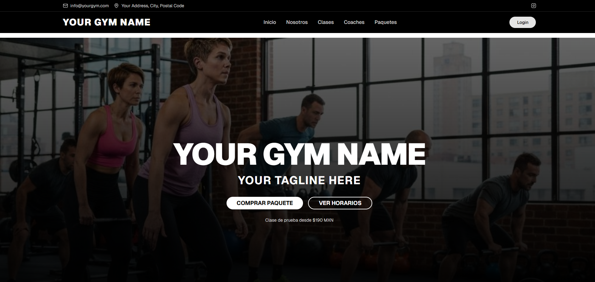
      </a>
      <h3>Rogue Fit</h3>
      
Experiencia de fitness y entrenamiento personalizado.

      
<a href="https://rogue-fit.wordev.lat/"><strong>Ver proyecto</strong>&nbsp;</a>

    </td>
    <td width="50%" valign="top" align="center">
      <a href="https://gym.wordev.lat/">
        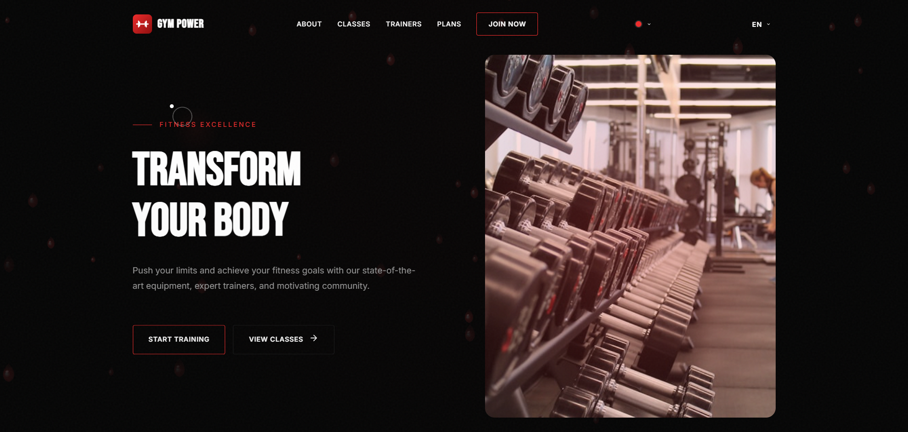
      </a>
      <h3>Gym Center</h3>
      
Sistema digital de gestión para gimnasios.

      
<a href="https://gym.wordev.lat/"><strong>Ver proyecto</strong>&nbsp;</a>

    </td>
  </tr>
  <tr>
    <td width="50%" valign="top" align="center">
      <a href="https://hotel.wordev.lat/">
        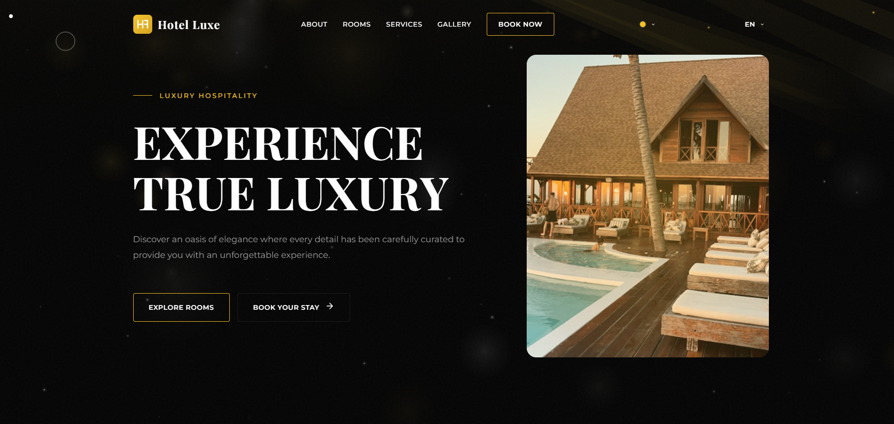
      </a>
      <h3>Hotel Boutique</h3>
      
Reservas y experiencia digital para hotelería.

      
<a href="https://hotel.wordev.lat/"><strong>Ver proyecto</strong>&nbsp;</a>

    </td>
    <td width="50%" valign="top" align="center">
      <a href="https://gourmet.wordev.lat/">
        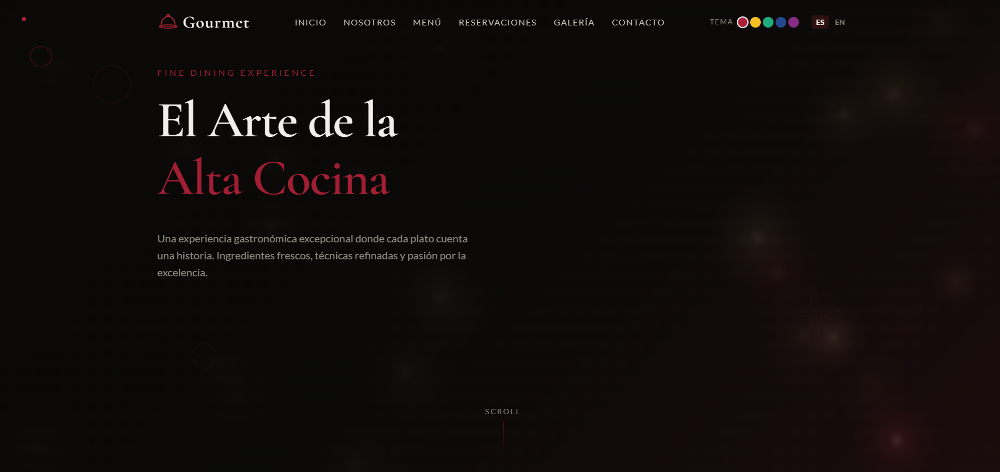
      </a>
      <h3>Gourmet Kitchen</h3>
      
Presencia gastronómica con menú y narrativa visual.

      
<a href="https://gourmet.wordev.lat/"><strong>Ver proyecto</strong>&nbsp;</a>

    </td>
  </tr>
  <tr>
    <td colspan="2" valign="top" align="center">
      <a href="https://art-galery.wordev.lat/">
        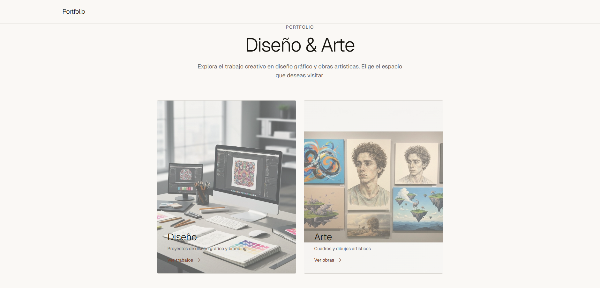
      </a>
      <h3>Art Gallery</h3>
      
Galería virtual para descubrir y recorrer arte de una manera diferente.

      
<a href="https://art-galery.wordev.lat/"><strong>Ver proyecto</strong>&nbsp;</a>

    </td>
  </tr>
</table>

## De la idea al lanzamiento

  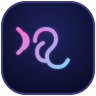
  &nbsp;&nbsp;&nbsp;
  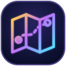
  &nbsp;&nbsp;&nbsp;
  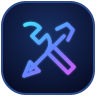
  &nbsp;&nbsp;&nbsp;
  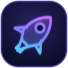
  &nbsp;&nbsp;&nbsp;
  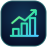

1. **Escuchamos.** Entendemos tu idea, tus clientes y el resultado que buscas.
2. **Trazamos el camino.** Definimos qué construiremos y qué haremos primero.
3. **Lo hacemos realidad.** Diseñamos, desarrollamos y revisamos cada parte contigo.
4. **Lo lanzamos.** Publicamos el producto y comprobamos que todo funcione correctamente.
5. **Lo ayudamos a crecer.** Seguimos presentes para mantenerlo y mejorarlo.

## Trabajar con WordDev significa

- **Entender antes de construir.** Primero escuchamos tu necesidad y tus objetivos.
- **Hablar claro.** Explicamos avances, decisiones y dificultades sin palabras complicadas.
- **Saber siempre dónde estamos.** Acordamos desde el inicio el alcance, las prioridades y los costos.
- **Pensar en el futuro.** Creamos una base que pueda adaptarse a nuevas necesidades.
- **Seguir después del lanzamiento.** Te acompañamos cuando el producto ya está en manos de sus usuarios.

 

  <a href="https://wordev.lat/#contacto">
    <picture>
      <source media="(max-width: 640px)" srcset="./assets/contact-wordlings-mobile.png" />
      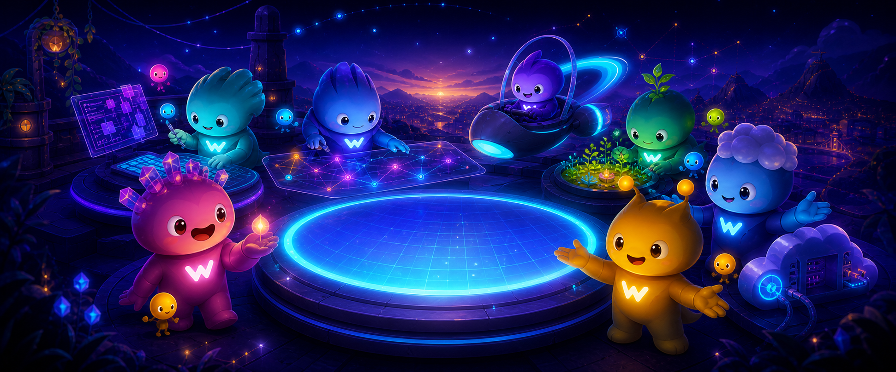
    </picture>
  </a>

   
  <strong>Tu idea puede ser nuestro próximo proyecto.</strong>
   
  Cuéntanos qué quieres crear.
    
  <a href="https://wordev.lat/">wordev.lat</a>
  &nbsp;·&nbsp;
  <a href="mailto:hola@worddev.com">hola@worddev.com</a>
  &nbsp;·&nbsp;
  <a href="https://wa.me/573215011683">WhatsApp</a>
  &nbsp;·&nbsp;
  <a href="https://www.linkedin.com/in/wordev-8699253a4/">LinkedIn</a>
    
  Creamos productos digitales desde Colombia para cualquier lugar. ❤️

