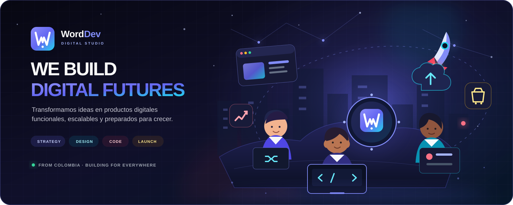

<div align="center">
  
</div>

<div align="center">
  <br />
  <a href="https://wordev.lat/"><strong>Sitio web</strong></a>
  &nbsp;·&nbsp;
  <a href="#proyectos-destacados"><strong>Explorar proyectos</strong></a>
  &nbsp;·&nbsp;
  <a href="https://wa.me/573215011683"><strong>Hablemos</strong></a>
  &nbsp;·&nbsp;
  <a href="./README.en.md"><strong>English</strong></a>
</div>

<br />

## Hola, somos WordDev

Somos un estudio de desarrollo digital que transforma ideas en **productos tecnológicos funcionales, escalables y preparados para crecer**. Acompañamos cada proyecto desde la conversación inicial y la estrategia hasta el lanzamiento, la medición y la evolución continua.

No nos limitamos a escribir código. Entendemos el negocio, diseñamos la experiencia y construimos la tecnología necesaria para convertir una buena idea en una solución digital rentable.

```javascript
const partnership = await worddev.build({
  idea: "tuya",
  strategy: "compartida",
  technology: "a la medida",
  goal: "crecer juntos",
});
```

## Lo que construimos

<table>
  <tr>
    <td width="50%" valign="top">
      <h3>01 · Estrategia de producto</h3>
      <p>Convertimos una idea en una propuesta clara: usuarios, alcance, prioridades, modelo de negocio y ruta de ejecución.</p>
      <p><code>Discovery</code> <code>Research</code> <code>Roadmap</code> <code>MVP</code></p>
    </td>
    <td width="50%" valign="top">
      <h3>02 · Desarrollo a medida</h3>
      <p>Creamos sitios, aplicaciones, plataformas, sistemas de gestión y experiencias digitales sin depender de soluciones genéricas.</p>
      <p><code>Web Apps</code> <code>E-commerce</code> <code>APIs</code> <code>SaaS</code></p>
    </td>
  </tr>
  <tr>
    <td width="50%" valign="top">
      <h3>03 · Lanzamiento y despliegue</h3>
      <p>Preparamos infraestructura, dominio, seguridad, rendimiento y automatización para llevar cada producto a producción con confianza.</p>
      <p><code>DevOps</code> <code>Docker</code> <code>SSL</code> <code>CI/CD</code></p>
    </td>
    <td width="50%" valign="top">
      <h3>04 · Soporte y crecimiento</h3>
      <p>Seguimos después del lanzamiento: observamos, mantenemos, corregimos y encontramos nuevas oportunidades de evolución.</p>
      <p><code>Analytics</code> <code>SEO</code> <code>Backups</code> <code>Support</code></p>
    </td>
  </tr>
</table>

## Proyectos destacados

Una selección de experiencias creadas para explorar diferentes industrias, necesidades y formas de interacción digital.

<table>
  <tr>
    <td width="50%" valign="top" align="center">
      <a href="https://rogue-fit.wordev.lat/">
        
      </a>
      <h3>Rogue Fit</h3>
      <p>Experiencia de fitness y entrenamiento personalizado.</p>
      <p><a href="https://rogue-fit.wordev.lat/"><strong>Explorar proyecto ↗</strong></a></p>
    </td>
    <td width="50%" valign="top" align="center">
      <a href="https://gym.wordev.lat/">
        
      </a>
      <h3>Gym Center</h3>
      <p>Sistema digital de gestión para gimnasios.</p>
      <p><a href="https://gym.wordev.lat/"><strong>Explorar proyecto ↗</strong></a></p>
    </td>
  </tr>
  <tr>
    <td width="50%" valign="top" align="center">
      <a href="https://hotel.wordev.lat/">
        
      </a>
      <h3>Hotel Boutique</h3>
      <p>Reservas y experiencia digital para hotelería.</p>
      <p><a href="https://hotel.wordev.lat/"><strong>Explorar proyecto ↗</strong></a></p>
    </td>
    <td width="50%" valign="top" align="center">
      <a href="https://gourmet.wordev.lat/">
        
      </a>
      <h3>Gourmet Kitchen</h3>
      <p>Presencia gastronómica con menú y narrativa visual.</p>
      <p><a href="https://gourmet.wordev.lat/"><strong>Explorar proyecto ↗</strong></a></p>
    </td>
  </tr>
  <tr>
    <td colspan="2" valign="top" align="center">
      <a href="https://art-galery.wordev.lat/">
        
      </a>
      <h3>Art Gallery</h3>
      <p>Galería virtual para descubrir y recorrer arte de una manera diferente.</p>
      <p><a href="https://art-galery.wordev.lat/"><strong>Explorar proyecto ↗</strong></a></p>
    </td>
  </tr>
</table>

## Cómo llevamos una idea a producción

<div align="center">
  
</div>

## Tecnología con propósito

Elegimos las herramientas según el problema, la escala esperada y la realidad de cada proyecto. Nuestro ecosistema incluye:

| Experiencia | Aplicaciones | Datos | Entrega |
|:--|:--|:--|:--|
| React · Next.js | Node.js · Python | PostgreSQL | Docker · Nginx |
| TypeScript · Vite | PHP · Laravel | MySQL | Linux · CI/CD |
| UI/UX · Responsive | APIs · Integraciones | Modelado · Analytics | Hosting · Observabilidad |

## Cómo pensamos

- **El negocio primero.** Una solución técnicamente brillante solo importa si resuelve una necesidad real.
- **Comunicación directa.** Las decisiones, avances y riesgos deben entenderse sin intermediarios.
- **Código que pueda evolucionar.** Creamos bases limpias, documentadas y mantenibles.
- **Transparencia desde el inicio.** Alcance, prioridades y costos claros durante todo el proceso.
- **El lanzamiento no es el final.** Medimos, aprendemos y seguimos construyendo.

<br />

<div align="center">
  <a href="https://wordev.lat/#contacto">
    
  </a>
</div>

<div align="center">
  <br />
  <strong>¿Tienes una idea o un desafío digital?</strong>
  <br /><br />
  <a href="https://wordev.lat/">wordev.lat</a>
  &nbsp;·&nbsp;
  <a href="mailto:hola@worddev.com">hola@worddev.com</a>
  &nbsp;·&nbsp;
  <a href="https://wa.me/573215011683">WhatsApp</a>
  &nbsp;·&nbsp;
  <a href="https://www.linkedin.com/in/wordev-8699253a4/">LinkedIn</a>
  <br /><br />
  <sub>Hecho con criterio, curiosidad y código desde Colombia.</sub>
</div>
